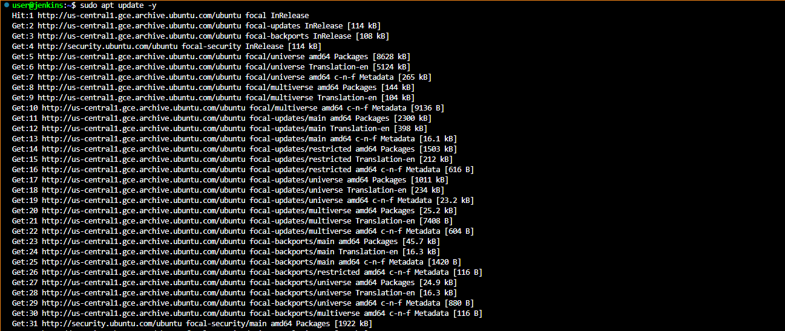
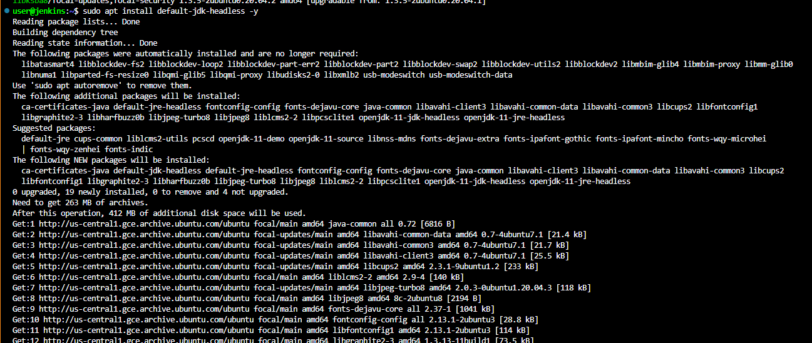
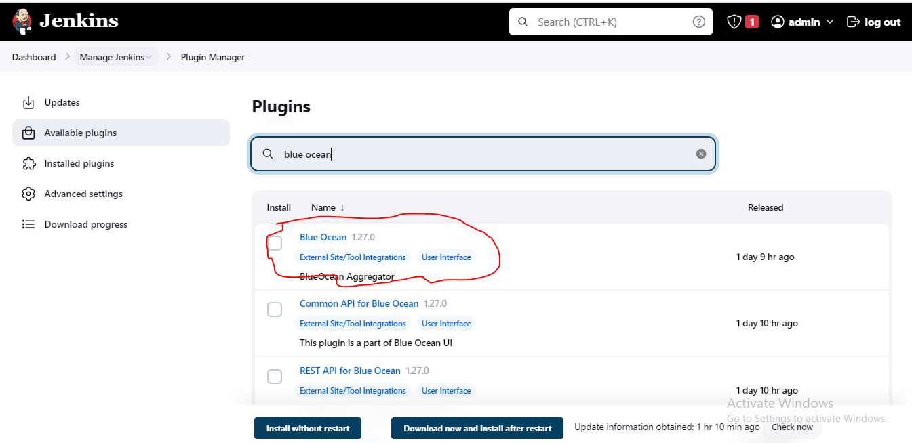
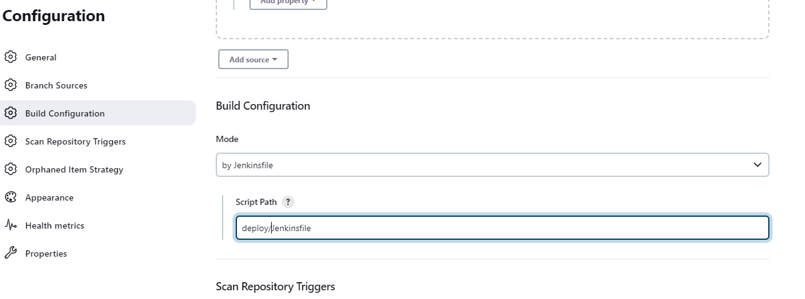

____
## **Project _14_ Experience Continous Integration with Jenkins|Ansible|Artifactory| Sonarqube|PHP**
____

### **Step 1 – Configuring Ansible For Jenkins Deployment**

In previous projects, I have been launching Ansible commands manually from a CLI. Now, with Jenkins, I we will start running Ansible from Jenkins UI.

> #### **Launch an Instance**
 
* I launched and instance based on Ubuntu Server 20.04 LTS and name it *`jenkins`*
* Installed JDK (since Jenkins is a Java-based application) with *`sudo apt update -y`* - *To Update the apt services*  and *`sudo apt install default-jdk-headless -y`* - *To install Java based apps*

>#### **Install Jenkins**
* *`wget -q -O - https://pkg.jenkins.io/debian-stable/jenkins.io.key | sudo apt-key add -`*
* *`sudo sh -c 'echo deb https://pkg.jenkins.io/debian-stable binary/ > \/etc/apt/sources.list.d/jenkins.list'`*
* *`sudo apt update -y`*
*`sudo apt-get install jenkins -y`*
* *`sudo systemctl status jenkins`* - *To ensure Jenkins is up and running*

>#### **Jenkins SetUp on the Web**
From my browser I access, Jenkins using 
* *`http://http://35.184.79.188:8080/`*
* *`sudo cat /var/lib/jenkins/secrets/nitialAdminPassword`* - *To Retrieve the default admin password*

>#### **Install Blue Ocean  and Create Ne Pipeline**
- Install Blue Ocean from Jenkins Plugin

- Create a new pipeline

- Select GitHub

- Connect Jenkins with GitHub by Login to GitHub to Generate an Access Token

- 
- Copy and Paste Access Token

- Create a new Pipeline

The newly created pipeline. It takes the name of your GitHub repository.

>#### **Create Jenkinsfile**
Inside the cloned ansible-config-mgt repo, I created a new directory called **`deploy`** using *`mkdir deploy`* and also creating a new file **`Jenkinsfile`** with *`touch Jenkinsfile1`* inside the directory.

Inside the Jenkinsfile the below code snippet is added to start building the Jenkinsfile gradually. 
This pipeline currently has just one stage called Build and the only thing we are doing is using the shell script module to echo Building Stage

    pipeline {
        agent any

      stages {
        stage('Build') {
          steps {
            script {
              sh 'echo "Building Stage"'
            }
          }
        }
        }
    }

Back in the Ansible pipeline in Jenkins, on the configure tab, on the  Build Configuration section the location of the `**Jenkinsfile`** was modified to **deploy/Jenkinsfile`**.

On the pipeline I click "Build now" which will trigger a build and its effect will seen on the Jenkins configurations on the console output tab.

To really appreciate and feel the difference of Ocean Blue UI, it is recommended to try triggering the build again from Blue Ocean interface.
- Click on Blue Ocean
- Select project
- Click on the play button against the branch

>#### Executing Multi-Branch Pipeline 

Notice that this pipeline is a multibranch one. This means, if there were more than one branch in GitHub, Jenkins would have scanned the repository to discover them all and we would have been able to trigger a build for each branch.

I Created a new git branch and name it *`feature/jenkinspipeline-stages`*
* *`Git checkout -b feature/jenkinspipeline-stages`*

Currently there is only the Build stage. Another stage was added called Test. 
* In the Jenkinfile i update the code snippet below and push the new changes to GitHub.

       pipeline {
        agent any

      stages {
        stage('Build') {
          steps {
            script {
              sh 'echo "Building Stage"'
            }
          }
        }

        stage('Test') {
          steps {
            script {
              sh 'echo "Testing Stage"'
            }
          }
        }
        }
    }

* On Jenkins the Repository was scanned

* The pipeline was build by clicking on the Build now Tab

On Blue Ocean, the Jenkinsfile has caused a new step in the pipeline launch build for the new branch.

_______
### **A Quick Task**
- Create a pull request to merge the latest code into the main branch
- After merging the PR, go back into your terminal and switch into the main branch.
- Pull the latest change.
- Create a new branch, add more stages into the Jenkins file to simulate below phases. (Just add an echo command like we have in build and test stages)
    - Package 
    - Deploy 
    - Clean up
- Verify in Blue Ocean that all the stages are working, then merge your feature branch to the main branch
- Eventually, your main branch should have a successful pipeline like this in blue ocean
______________________
### **Solution**

* Create a pull request to merge the latest code into the main branch using 
    * *`git checkout master`*
    * *`git merge feature/jenkinspipeline-stages*
    

* I Created a new branch, add more stages into the Jenkins file to simulate below phases. (Just add an echo command like we have in build and test stages)
    - Package 
    - Deploy 
    - Clean up
* Using the below command I added a new branch and Update the code in my Jenkinsfile as captured below
    * *`Git checkout -b feature/jenkinspipeline-morestages`*

       pipeline {
        agent any

      stages {
        stage('Build') {
          steps {
            script {
              sh 'echo "Building Stage"'
            }
          }
        }

        stage('Test') {
          steps {
            script {
              sh 'echo "Testing Stage"'
            }
          }
        }

        stage('Package') {
          steps {
            script {
              sh 'echo "Packaging Stage"'
            }
          }
        }

        stage('Deploy') {
          steps {
            script {
              sh 'echo "Deploying Stage"'
            }
          }
        }

        stage('Clean up') {
          steps {
            script {
              sh 'echo "Cleaning up Stage"'
            }
          }
        }
        }

    }

* On Jenkins the Repository was scanned

In Blue Ocean that all the stages are working, and all feature branch merged to the main branch

____
### **Step- 2 – Running Ansible Playbook from Jenkins**
_____
>#### Install Ansible  and dependencies uisng the following commands;
* *`sudo apt update`* - (Updated Apt Packages)
* *`sudo apt install ansible -y`* -(Install Ansible)
* *`ansible --version`* - (To Check Ansible Version)
* *`sudo apt-get install python3-pip`*
* *`python3 -m pip install --upgrade setuptools`*
* *`python3 -m pip install --upgrade pip`*
* *`python3 -m pip install PyMySQL`*
* *`python3 -m pip install mysql-connector-python`*

>#### Installing Ansible plugin in Jenkins UI
On the dashboard page, click on `Manage Jenkins` > `Manage plugins` > `Available` type in `ansible` and `install without restart`

>#### Configure ansible playbook
Click on `Dashboard` > `Manage Jenkins` > `Global Tool Configuration` > `Add Ansible`. Add a name and the path ansible is installed on the jenkins server. to check the path *`which ansible`* is used.

Creating Jenkinsfile from scratch. (Delete all you currently have in there and start all over to get Ansible to run successfully)

### Project End