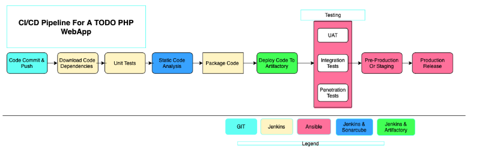

# Project _14_ Experience Continous Integration with Jenkins|Ansible|Artifactory| Sonarqube|PHP

In this Project I will be simulating a typical CI/CD Pipeline for a PHP based application.

As part of the ongoing infrastructure development with Ansible started from Project 11, you will be tasked to create a pipeline that simulates continuous integration and delivery. Target end to end CI/CD pipeline is represented by the diagram below. It is important to know that both Tooling and TODO Web Applications are based on an interpreted (scripting) language (PHP). It means, it can be deployed directly onto a server and will work without compiling the code to a machine language.

## Set Up

This project is partly a continuation of your Ansible work, so simply add and subtract based on the new setup in this project. It will require a lot of servers to simulate all the different environments from dev/ci all the way to production. This will be quite a lot of servers altogether (But you don’t have to create them all at once. Only create servers required for an environment you are working with at the moment. For example, when doing deployments for development, do not create servers for integration, pentest, or production yet).

